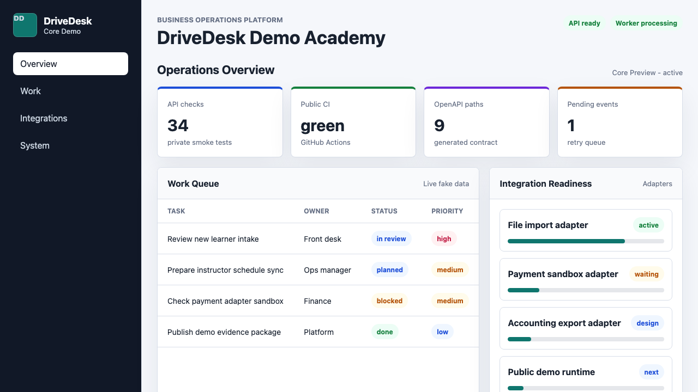

# DriveDesk Core

[](https://github.com/AlexGerlitz/drivedesk-core/actions/workflows/ci.yml)

DriveDesk Core is a modular monolith backend foundation for a business
operations platform.

It includes:

- FastAPI API;
- PostgreSQL migrations with Alembic;
- background worker;
- tenant, user, membership, RBAC, audit, and outbox foundation;
- credential auth foundation with bearer access tokens, current-user lookup,
  token revocation, redacted session listing, admin-triggered session revocation,
  failed-attempt guard, and auth audit events;
- dedicated platform-admin grants for platform-scoped bearer-token operations;
- aggregate auth metrics for session lifecycle and login-attempt outcomes;
- auth security alert names and public-safe runbook shape;
- bearer-token tenant isolation for tenant/user listing and bootstrap endpoints;
- reusable tenant-scope helper module for Core list queries;
- reusable tenant-owned repository helper module for models with `tenant_id`;
- tenant-owned business record foundation for contracts, payments, lessons,
  tasks, and documents;
- business record lifecycle transition endpoint with audit, outbox, and aggregate metrics;
- tenant-owned workflow rules for business record status automation;
- workflow rule audit, configured outbox handoff, and aggregate workflow metrics;
- workflow actions for task record creation and adapter sync requests;
- fake file import adapter with retry and dead-letter state;
- runtime adapter catalog for executable adapter metadata;
- synthetic lead-to-student workflow in the public demo payload;
- generated OpenAPI client SDK example for the public demo API;
- public-safe synthetic backup/restore drill with sanitized evidence;
- public-safe synthetic release rollback drill with sanitized evidence;
- Docker Compose local runtime;
- pytest coverage for the Core API;
- architecture docs and ADRs.

[](https://github.com/AlexGerlitz/drivedesk-core/actions/workflows/public-demo-health.yml)

## Live Demo

[Open the public DriveDesk Core demo](https://alexgerlitz.github.io/drivedesk-core/apps/admin/public-demo/)



## Reviewer Path

1. Open the live demo.
2. Review `docs/openapi.json`.
3. Run `bash scripts/check_public_demo_api.sh`.
4. Run one client example from `examples/`.
5. Read `docs/public/API_BACKED_DEMO.md`.
6. Read `docs/public/WORKFLOW_DEMO.md`.
7. Read `docs/public/WORKFLOW_RULES.md`.
8. Read `docs/public/WORKFLOW_ACTION_RUNS.md`.
9. Read `docs/public/AUTH_FOUNDATION.md`.
10. Read `docs/public/AUTH_OBSERVABILITY.md`.
11. Read `docs/public/SESSION_REVOCATION.md`.
12. Read `docs/public/PLATFORM_ADMIN.md`.
13. Read `docs/public/TENANT_ISOLATION.md`.
14. Read `docs/public/BUSINESS_RECORDS.md`.
15. Read `docs/public/BUSINESS_RECORD_LIFECYCLE.md`.
16. Read `docs/public/CLIENT_SDK.md`.
17. Read `docs/public/INTEGRATION_ADAPTER_CATALOG.md`.
18. Read `docs/public/INTEGRATION_MAPPING_VALIDATION.md`.
19. Read `docs/public/INTEGRATION_MAPPING_TRANSFORM.md`.
20. Read `docs/public/INTEGRATION_CONNECTION_SCOPES.md`.
21. Read `docs/public/INTEGRATION_OPERATION_CONTRACTS.md`.
22. Read `docs/public/INTEGRATION_ACCOUNTING_EXPORT.md`.
23. Read `docs/public/INTEGRATION_CONNECTION_DIAGNOSTICS.md`.
24. Read `docs/public/INTEGRATION_RECONCILIATION.md`.
25. Read `docs/public/INTEGRATION_INCIDENT_RUNBOOKS.md`.
26. Read `docs/public/INTEGRATION_OPERATOR_REVIEW.md`.
27. Read `docs/public/INTEGRATION_CONNECTIONS.md`.
28. Read `docs/public/SYSTEM_DESIGN.md`.
29. Read `docs/public/INTEGRATION_ADAPTERS.md`.
30. Read `docs/public/INTEGRATION_OBSERVABILITY.md`.
31. Read `docs/public/OUTBOX_RECOVERY.md`.
32. Read `docs/public/BACKUP_RESTORE_EVIDENCE.md`.
33. Read `docs/public/RELEASE_ROLLBACK_EVIDENCE.md`.
34. Read `docs/public/SLO_CANARY_GATE_EVIDENCE.md`.
35. Read `docs/public/STAGED_PROMOTION_EVIDENCE.md`.
36. Read `docs/public/HELM_CHART.md`.
37. Read `docs/public/GITOPS_DELIVERY.md`.
38. Read `docs/public/GITOPS_PROMOTION_DRIFT.md`.
39. Read `docs/public/GITOPS_DRIFT_REMEDIATION.md`.
40. Read `docs/public/PORTFOLIO_CASE_STUDY.md`.
41. Check `.github/workflows/ci.yml`.
42. Run `bash scripts/ci_smoke_public.sh` locally.

## What To Review First

- `docs/public/PORTFOLIO_CASE_STUDY.md` - engineering case study.
- `docs/public/SYSTEM_DESIGN.md` - system design overview.
- `docs/public/API_BACKED_DEMO.md` - read-only synthetic demo API contract.
- `docs/public/WORKFLOW_DEMO.md` - synthetic business workflow contract.
- `docs/public/WORKFLOW_RULES.md` - tenant-owned workflow rules contract.
- `docs/public/WORKFLOW_ACTION_RUNS.md` - workflow action execution history.
- `docs/public/AUTH_FOUNDATION.md` - auth, bearer token, and RBAC overview.
- `docs/public/AUTH_OBSERVABILITY.md` - auth metrics, alert names, and runbook shape.
- `docs/public/SESSION_REVOCATION.md` - admin-triggered tenant/platform session revocation.
- `docs/public/PLATFORM_ADMIN.md` - dedicated platform-admin model and SaaS control-plane boundary.
- `docs/public/TENANT_ISOLATION.md` - tenant isolation and bootstrap boundary overview.
- `docs/public/BUSINESS_RECORDS.md` - tenant-owned business record foundation.
- `docs/public/BUSINESS_RECORD_LIFECYCLE.md` - lifecycle policy catalog and preview validation.
- `docs/public/CLIENT_SDK.md` - generated OpenAPI client SDK example.
- `docs/public/INTEGRATION_ADAPTER_CATALOG.md` - runtime adapter metadata and discovery contract.
- `docs/public/INTEGRATION_MAPPING_VALIDATION.md` - mapping validation against adapter requirements.
- `docs/public/INTEGRATION_MAPPING_TRANSFORM.md` - runtime mapping transform and preview.
- `docs/public/INTEGRATION_CONNECTION_SCOPES.md` - least-privilege connection scopes.
- `docs/public/INTEGRATION_OPERATION_CONTRACTS.md` - operation-level adapter contracts.
- `docs/public/INTEGRATION_ACCOUNTING_EXPORT.md` - executable outbound accounting export adapter.
- `docs/public/INTEGRATION_CONNECTION_DIAGNOSTICS.md` - safe connection health-checks and metrics.
- `docs/public/INTEGRATION_RECONCILIATION.md` - safe provider evidence comparison and diff.
- `docs/public/INTEGRATION_INCIDENT_RUNBOOKS.md` - runbook-backed incident cards for integration signals.
- `docs/public/INTEGRATION_OPERATOR_REVIEW.md` - safe review queue for failed integration jobs.
- `docs/public/INTEGRATION_CONNECTIONS.md` - tenant-owned adapter profiles and mapping.
- `docs/public/INTEGRATION_ADAPTERS.md` - adapter contract and retry model.
- `docs/public/INTEGRATION_OBSERVABILITY.md` - adapter metrics and worker log signals.
- `docs/public/OUTBOX_RECOVERY.md` - audited operator retry path for failed outbox jobs.
- `docs/public/BACKUP_RESTORE_EVIDENCE.md` - public-safe synthetic backup and restore drill.
- `docs/public/RELEASE_ROLLBACK_EVIDENCE.md` - public-safe bad-release rollback drill.
- `docs/public/SLO_CANARY_GATE_EVIDENCE.md` - public-safe SLO canary promotion gate drill.
- `docs/public/STAGED_PROMOTION_EVIDENCE.md` - public-safe staged release promotion drill.
- `docs/public/HELM_CHART.md` - public-safe Helm chart foundation.
- `docs/public/GITOPS_DELIVERY.md` - public-safe GitOps delivery foundation.
- `docs/public/GITOPS_PROMOTION_DRIFT.md` - public-safe GitOps image promotion and drift evidence.
- `docs/public/GITOPS_DRIFT_REMEDIATION.md` - public-safe GitOps drift remediation evidence.
- `docs/public/ARCHITECTURE_DIAGRAMS.md` - architecture diagrams.
- `docs/public/SANITIZED_EVIDENCE.md` - sanitized staging evidence.
- `docs/public/PUBLIC_DEMO_PLAN.md` - future public demo plan.
- `docs/public/ROADMAP.md` - public-safe engineering roadmap.
- `apps/admin/public-demo/index.html` - static fake-data product demo shell.
- `docs/openapi.json` - generated FastAPI OpenAPI schema.
- `GET /demo/public` - read-only synthetic demo payload in the exported API.
- `GET /integration-adapters` - runtime adapter catalog endpoint.
- `POST /tenants/{tenant_id}/integration-mapping-preview` - read-only mapping transform preview.
- `file_import:preview` and `file_import:execute` - public-safe connection scope examples.
- `GET /metrics` - public-safe aggregate metrics including auth health.
- `POST /auth/sessions/{session_id}/revoke` - admin-triggered visible session revocation.
- `POST /platform/admins` - platform-admin grant endpoint.
- `GET /platform/admins` - platform-admin grant review endpoint.
- `POST /tenants/{tenant_id}/business-records` - tenant-owned business record creation.
- `GET /tenants/{tenant_id}/business-records` - tenant-owned business record listing.
- `POST /tenants/{tenant_id}/business-records/{record_id}/transition` - auditable business status transition.
- `drivedesk_business_records` - aggregate business record metric by type and status.
- `internal.business_record` - adapter key used by business record outbox events.
- `POST /tenants/{tenant_id}/workflow-rules` - tenant-owned workflow rule creation.
- `GET /tenants/{tenant_id}/workflow-rules` - tenant-owned workflow rule listing.
- `workflow.rule.triggered` - audit event for matching workflow rules.
- `workflow.contract_approved` - public-safe example workflow outbox event.
- `create_task_record` - workflow action that creates tenant-owned task records.
- `request_adapter_sync` - workflow action that requests retryable adapter work.
- `workflow.task_record.created` - workflow outbox event for task creation.
- `workflow.contract_sync.requested` - public-safe example adapter sync request.
- `drivedesk_workflow_rules` - aggregate workflow rule metric by status, trigger, and action.
- `internal.workflow` - adapter key used by workflow rule outbox events.
- `DriveDeskMetricsStorageUnavailable`, `DriveDeskAuthFailureSpike`, and
  `DriveDeskAuthLockedAttempts` - public-safe auth alert contract.
- `workflow`, `timeline`, and `domainEvents` - synthetic business process data
  in the public demo payload.
- `sdk/generated/public-demo/` - generated client SDK artifacts.
- `sdk/generated/public-demo/python/drivedesk_public_demo_client.py` - generated Python SDK client.
- `sdk/generated/public-demo/javascript/drivedesk-public-demo-client.mjs` - generated JavaScript SDK client.
- `sdk/generated/public-demo/typescript/drivedesk-public-demo-client.d.ts` - generated TypeScript definitions.
- `scripts/generate_public_demo_sdk.py` - SDK generator from OpenAPI.
- `scripts/check_public_demo_sdk.sh` - generated SDK drift and runtime smoke.
- `scripts/check_public_backup_restore.sh` - public-safe synthetic recovery drill.
- `scripts/check_public_release_rollback.sh` - public-safe release rollback drill.
- `scripts/check_public_slo_canary_gate.sh` - public-safe SLO canary gate drill.
- `scripts/check_public_staged_promotion.sh` - public-safe staged promotion drill.
- `scripts/check_public_helm_render.sh` - public-safe Helm chart validation.
- `scripts/check_public_gitops_layout.sh` - public-safe GitOps layout validation.
- `scripts/check_public_gitops_promotion_drift.sh` - public-safe GitOps promotion and drift validation.
- `scripts/check_public_gitops_drift_remediation.sh` - public-safe GitOps drift remediation validation.
- `scripts/run_public_demo_local.sh` - one-command local API run.
- `scripts/check_public_demo_api.sh` - local API contract and examples smoke.
- `examples/curl/demo-public.sh` - curl client example.
- `examples/python/demo_public_client.py` - Python client example.
- `examples/js/demo-public-fetch.js` - JavaScript fetch client example.

## Local Run

```bash
python -m pip install -r requirements.txt
bash scripts/run_public_demo_local.sh
```

Health:

```bash
curl http://localhost:8080/health
curl http://localhost:8080/demo/public
```

API contract and client examples:

```bash
bash scripts/check_public_demo_api.sh
bash scripts/check_public_demo_sdk.sh
bash scripts/check_public_backup_restore.sh
bash scripts/check_public_release_rollback.sh
bash scripts/check_public_slo_canary_gate.sh
bash scripts/check_public_staged_promotion.sh
bash scripts/check_public_helm_render.sh
bash scripts/check_public_gitops_layout.sh
bash scripts/check_public_gitops_promotion_drift.sh
bash scripts/check_public_gitops_drift_remediation.sh
BASE_URL=http://localhost:8080 bash examples/curl/demo-public.sh
BASE_URL=http://localhost:8080 python examples/python/demo_public_client.py
BASE_URL=http://localhost:8080 node examples/js/demo-public-fetch.js
```

Docker Compose:

```bash
docker compose -f infra/docker/docker-compose.foundation.yml up --build
```

## Checks

```bash
bash scripts/ci_smoke_public.sh
bash scripts/check_public_demo_api.sh
bash scripts/check_public_backup_restore.sh
bash scripts/check_public_release_rollback.sh
bash scripts/check_public_slo_canary_gate.sh
bash scripts/check_public_staged_promotion.sh
bash scripts/check_public_helm_render.sh
bash scripts/check_public_gitops_layout.sh
bash scripts/check_public_gitops_promotion_drift.sh
bash scripts/check_public_gitops_drift_remediation.sh
```

## Public Demo Shell

Open the hosted demo:

```text
https://alexgerlitz.github.io/drivedesk-core/apps/admin/public-demo/
```

Or open this file directly in a browser:

```text
apps/admin/public-demo/index.html
```

For local API-backed mode, run the FastAPI app and open:

```text
apps/admin/public-demo/index.html?demoApi=http://localhost:8080/demo/public
```

## Architecture

- `docs/PROJECT_DIRECTION.md`
- `docs/DRIVEDESK_CORE.md`
- `docs/INFRASTRUCTURE_TARGET.md`
- `docs/DEVOPS_ROADMAP.md`
- `docs/public/README.md`
- `docs/public/PORTFOLIO_CASE_STUDY.md`
- `docs/public/SYSTEM_DESIGN.md`
- `docs/public/API_BACKED_DEMO.md`
- `docs/public/WORKFLOW_DEMO.md`
- `docs/public/WORKFLOW_RULES.md`
- `docs/public/WORKFLOW_ACTION_RUNS.md`
- `docs/public/AUTH_FOUNDATION.md`
- `docs/public/AUTH_OBSERVABILITY.md`
- `docs/public/SESSION_REVOCATION.md`
- `docs/public/PLATFORM_ADMIN.md`
- `docs/public/TENANT_ISOLATION.md`
- `docs/public/BUSINESS_RECORDS.md`
- `docs/public/BUSINESS_RECORD_LIFECYCLE.md`
- `docs/public/CLIENT_SDK.md`
- `docs/public/INTEGRATION_ADAPTER_CATALOG.md`
- `docs/public/INTEGRATION_MAPPING_VALIDATION.md`
- `docs/public/INTEGRATION_MAPPING_TRANSFORM.md`
- `docs/public/INTEGRATION_CONNECTION_SCOPES.md`
- `docs/public/INTEGRATION_OPERATION_CONTRACTS.md`
- `docs/public/INTEGRATION_ACCOUNTING_EXPORT.md`
- `docs/public/INTEGRATION_CONNECTION_DIAGNOSTICS.md`
- `docs/public/INTEGRATION_RECONCILIATION.md`
- `docs/public/INTEGRATION_INCIDENT_RUNBOOKS.md`
- `docs/public/INTEGRATION_OPERATOR_REVIEW.md`
- `docs/public/INTEGRATION_CONNECTIONS.md`
- `docs/public/INTEGRATION_ADAPTERS.md`
- `docs/public/INTEGRATION_OBSERVABILITY.md`
- `docs/public/OUTBOX_RECOVERY.md`
- `docs/public/BACKUP_RESTORE_EVIDENCE.md`
- `docs/public/RELEASE_ROLLBACK_EVIDENCE.md`
- `docs/public/SLO_CANARY_GATE_EVIDENCE.md`
- `docs/public/STAGED_PROMOTION_EVIDENCE.md`
- `docs/public/HELM_CHART.md`
- `docs/public/GITOPS_DELIVERY.md`
- `docs/public/ARCHITECTURE_DIAGRAMS.md`
- `docs/public/PUBLIC_DEMO_PLAN.md`
- `docs/public/SANITIZED_EVIDENCE.md`
- `docs/public/ROADMAP.md`
- `docs/openapi.json`
- `docs/adr/0001-modular-monolith-first.md`
- `docs/adr/0006-drivedesk-core-foundation.md`
- `docs/adr/0007-identity-rbac-audit-outbox-foundation.md`
- `docs/adr/0014-integration-adapter-foundation.md`
- `docs/adr/0015-core-auth-token-foundation.md`
- `docs/adr/0016-auth-lifecycle-audit-guard.md`
- `docs/adr/0017-bearer-tenant-isolation.md`
- `docs/adr/0018-tenant-scope-query-helpers.md`
- `docs/adr/0019-tenant-owned-repository-helpers.md`
- `docs/adr/0020-admin-visible-auth-session-listing.md`
- `docs/adr/0021-auth-observability-metrics.md`
- `docs/adr/0022-auth-security-alerts.md`
- `docs/adr/0023-dedicated-platform-admin-model.md`
- `docs/adr/0024-admin-triggered-session-revocation.md`
- `docs/adr/0025-tenant-owned-business-record-foundation.md`
- `docs/adr/0026-business-record-lifecycle-and-metrics.md`
- `docs/adr/0027-workflow-rule-foundation.md`
- `docs/adr/0028-workflow-actions-task-and-adapter-sync.md`
- `docs/adr/0029-workflow-action-run-observability.md`
- `docs/adr/0030-outbox-retry-recovery.md`
- `docs/adr/0031-tenant-owned-integration-connections.md`
- `docs/adr/0032-runtime-adapter-catalog.md`
- `docs/adr/0033-integration-mapping-validation.md`
- `docs/adr/0034-integration-mapping-transform-preview.md`
- `docs/adr/0035-integration-connection-scopes.md`
- `docs/adr/0036-structured-adapter-operation-contracts.md`
- `docs/adr/0037-integration-operator-review-queue.md`
- `docs/adr/0038-business-record-lifecycle-policy-catalog.md`
- `docs/adr/0039-mock-accounting-export-adapter.md`
- `docs/adr/0040-integration-connection-diagnostics.md`
- `docs/adr/0041-integration-reconciliation-evidence.md`
- `docs/adr/0042-integration-incident-runbooks.md`
- `docs/adr/0043-public-safe-backup-restore-drill.md`
- `docs/adr/0044-public-safe-release-rollback-drill.md`
- `docs/adr/0045-public-safe-slo-canary-gate-drill.md`
- `docs/adr/0046-public-safe-staged-promotion-drill.md`
- `docs/adr/0047-public-safe-helm-chart-foundation.md`
- `docs/adr/0048-public-safe-gitops-delivery-foundation.md`
