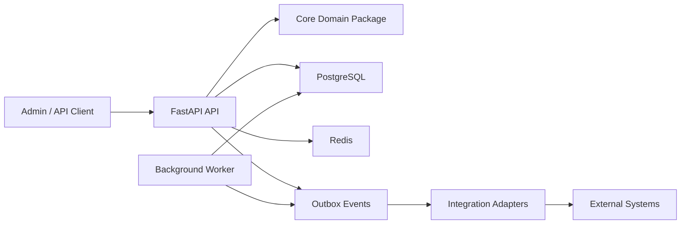
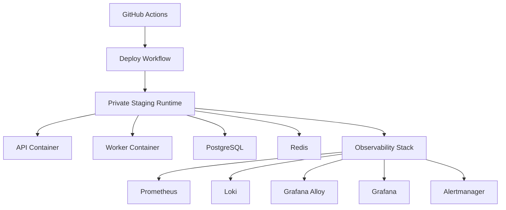
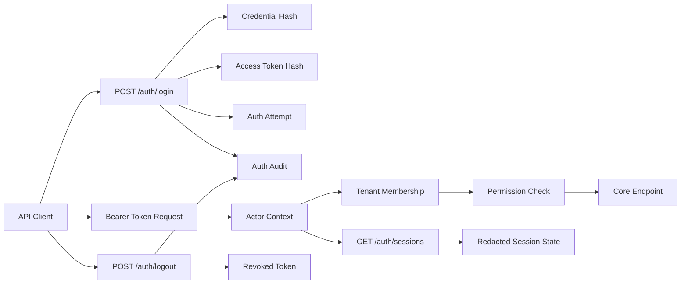
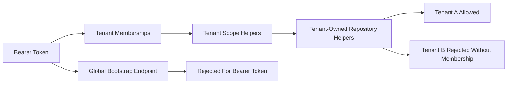
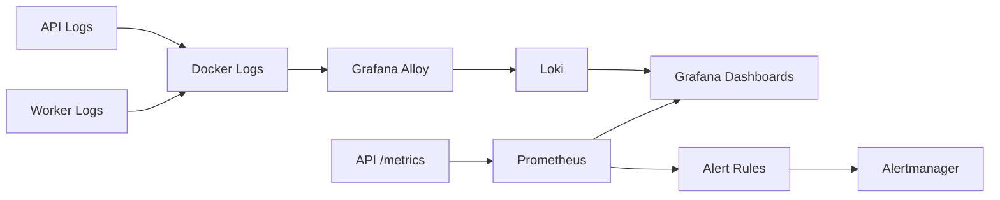
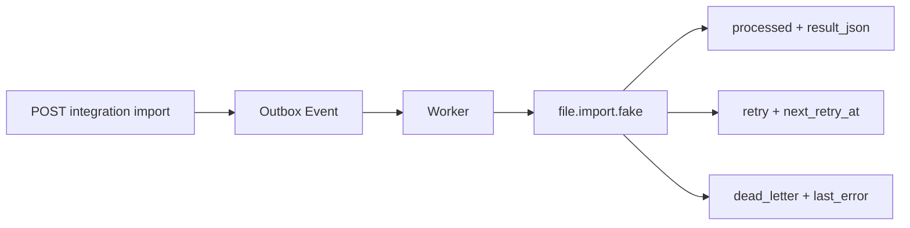
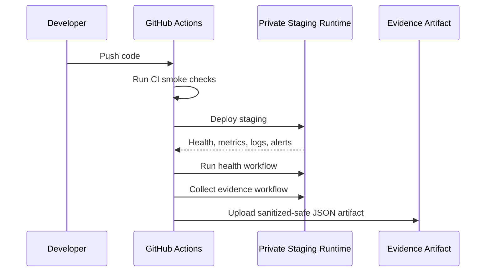
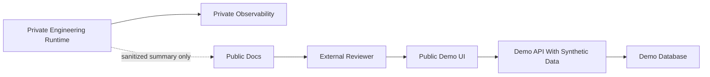

# DriveDesk Architecture Diagrams

These diagrams are public-safe and intentionally omit private hostnames,
addresses, credentials, and operational paths.

For the narrative system overview, start with `SYSTEM_DESIGN.md`. This file is
kept as the compact diagram set.

## Modular Monolith

## Runtime Shape

## Auth And RBAC

## Tenant Isolation

## Observability Flow

## Adapter Execution

## CI/CD and Evidence

## Future Public Demo Boundary

