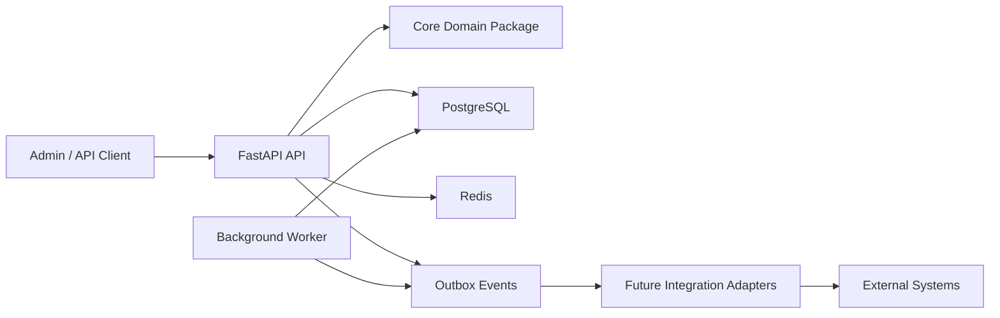
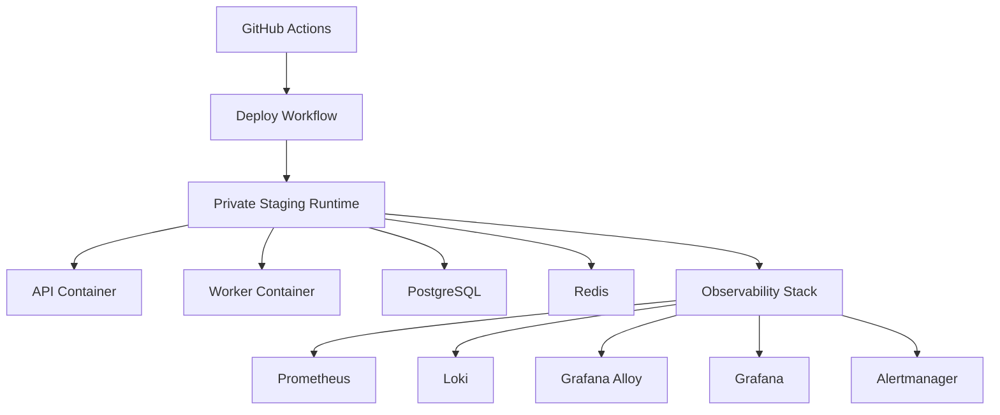
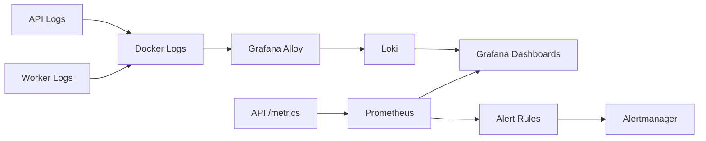
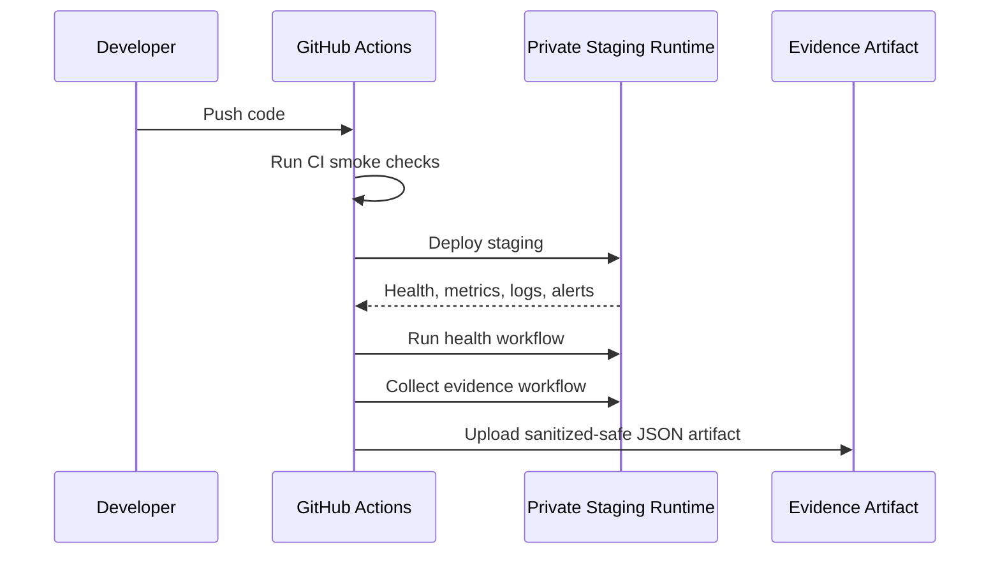
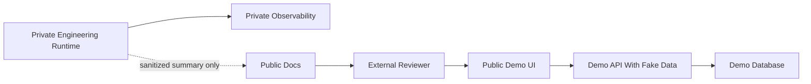

# DriveDesk Architecture Diagrams

These diagrams are public-safe and intentionally omit private hostnames,
addresses, credentials, and operational paths.

## Modular Monolith

## Runtime Shape

## Observability Flow

## CI/CD and Evidence

## Future Public Demo Boundary

