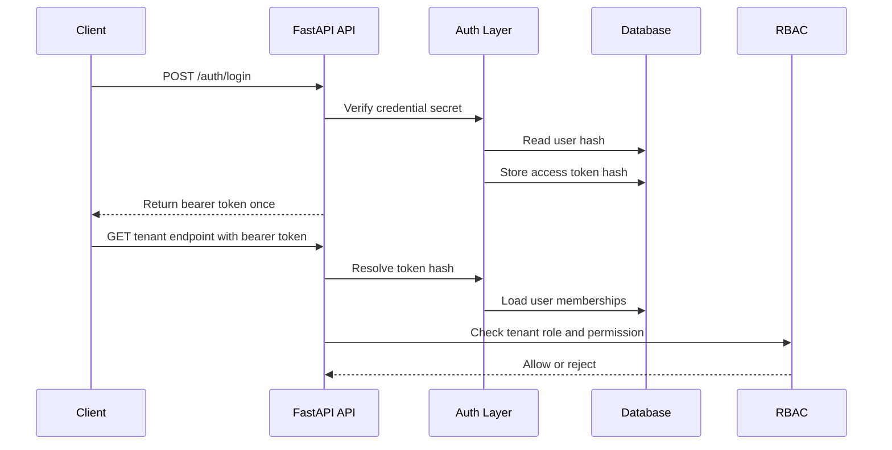

# DriveDesk Auth Foundation

DriveDesk Core now has a first credential-backed auth layer for the Core API.
It is intentionally small, but it proves the platform direction:

- users can be created with a private credential secret;
- the API stores only a derived credential hash;
- `POST /auth/login` issues a bearer access token;
- the database stores only a hash of the access token;
- `GET /auth/me` returns the current user and active memberships;
- bearer requests enter the same RBAC checks as the existing Core endpoints;
- tenant endpoints check the membership role for the requested tenant.

## API Shape

```text
POST /auth/login
GET /auth/me
```

The login response returns the access token once. Later requests use:

```text
Authorization: Bearer <access-token>
```

The token row keeps operational state:

- active or revoked;
- created time;
- expiry time;
- last-used time;
- user id;
- token hash.

## Request Flow



## Why This Matters

Before this layer, RBAC behavior was proven through development actor headers.
That was useful for early tests, but it did not prove a real user session path.

This layer adds the missing bridge:

- identity data;
- credential verification;
- access token lifecycle;
- current-user endpoint;
- token-backed authorization context;
- tenant-aware permission checks.

The actor headers still exist as a development bootstrap path. They are useful
for local setup and tests that create the first tenant and user records. Product
traffic should move toward bearer token auth.

## Next Hardening

Recommended next slices:

1. Add token revocation endpoint.
2. Add tenant-scoped query filters to every tenant-owned entity.
3. Add short-lived refresh flow or external identity provider integration.
4. Add auth audit events for login, failed login, and token revocation.
5. Add rate limiting for login attempts.
