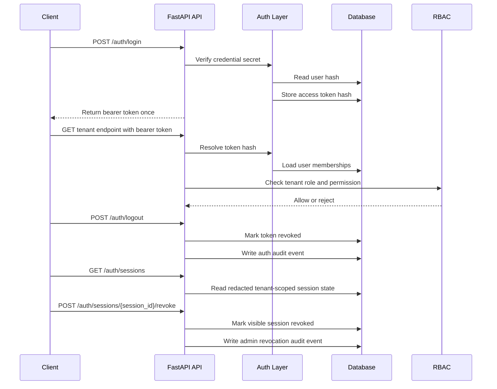

# DriveDesk Auth Foundation

DriveDesk Core now has a first credential-backed auth layer for the Core API.
It is intentionally small, but it proves the platform direction:

- users can be created with a private credential secret;
- the API stores only a derived credential hash;
- `POST /auth/login` issues a bearer access token;
- the database stores only a hash of the access token;
- `GET /auth/me` returns the current user, active memberships, and platform roles;
- `POST /auth/logout` revokes the current bearer access token;
- `GET /auth/sessions` returns redacted tenant-scoped session state for admins;
- `POST /auth/sessions/{session_id}/revoke` lets admins close visible sessions;
- `POST /platform/admins` grants a dedicated platform-admin role to a user;
- failed login attempts are recorded for operational review;
- repeated failed attempts activate a login guard;
- auth lifecycle events are written to the audit log;
- bearer requests enter the same RBAC checks as the existing Core endpoints;
- tenant endpoints check the membership role for the requested tenant.

## API Shape

```text
POST /auth/login
GET /auth/me
POST /auth/logout
GET /auth/sessions
POST /auth/sessions/{session_id}/revoke
POST /platform/admins
GET /platform/admins
```

The login response returns the access token once. Later requests use:

```text
Authorization: Bearer <access-token>
```

The token row keeps operational state:

- active or revoked;
- created time;
- expiry time;
- last-used time;
- user id;
- token hash.

The session listing endpoint returns only redacted state:

- token id;
- user id and display fields;
- active or revoked status;
- created, expiry, last-used, and revoked timestamps;
- tenant ids visible to the current admin.

It does not return raw access tokens or token hashes.

Admin-triggered session revocation uses the redacted session id. It never needs
the raw bearer token or token hash. Tenant owners/admins can revoke visible
tenant sessions; platform admins can revoke any session.

The platform-admin endpoint stores global operator grants separately from
tenant memberships. A tenant owner does not become a platform admin by having
the `owner` role inside one tenant.

The auth-attempt row keeps review state:

- email;
- user id when known;
- success, failure, or locked outcome;
- reason;
- created time.

The metrics endpoint exposes only aggregate auth health:

```text
drivedesk_auth_sessions{status="active"} 2
drivedesk_auth_sessions{status="revoked"} 1
drivedesk_auth_attempts_total{outcome="success"} 3
```

Those metrics intentionally use only `status` and `outcome` labels. They do not
include emails, user ids, tenant ids, token ids, token hashes, raw bearer tokens,
or request bodies.

If storage-backed aggregate queries are temporarily unavailable, `/metrics`
still returns Prometheus text and marks the degraded part explicitly:

```text
drivedesk_metrics_storage_available 0
```

The private staging alerting layer watches these aggregate signals with
Prometheus rules:

- `DriveDeskMetricsStorageUnavailable`;
- `DriveDeskAuthFailureSpike`;
- `DriveDeskAuthLockedAttempts`.

The public contract is the important part: alerts are based on counts and
outcomes, not on emails, token ids, token hashes, bearer tokens, or request
bodies.

## Request Flow



## Why This Matters

Before this layer, RBAC behavior was proven through development actor headers.
That was useful for early tests, but it did not prove a real user session path.

This layer adds the missing bridge:

- identity data;
- credential verification;
- access token lifecycle;
- current-user endpoint;
- token-backed authorization context;
- token revocation;
- admin-visible redacted session listing;
- admin-triggered session revocation;
- dedicated platform-admin grants;
- failed-attempt guard;
- auth audit events;
- aggregate auth metrics;
- tenant-aware permission checks.

The actor headers still exist as a development bootstrap path. They are useful
for local setup and tests that create the first tenant and user records. Product
traffic should move toward bearer token auth.

## Operational Events

The auth layer writes platform audit events:

```text
auth.login.failed
auth.login.locked
auth.login.succeeded
auth.token.revoked
auth.token.admin_revoked
platform_admin.granted
```

This matters because auth is an operational surface. A reviewer can now see not
only that access works, but that failed access, guard activation, and token
revocation are visible system events.

## Next Hardening

Recommended next slices:

1. Add short-lived refresh flow or external identity provider integration.
2. Add approval workflow for platform-admin grants.
3. Add stronger device/session metadata.
4. Add broader auth/device risk scoring after the session metadata exists.
