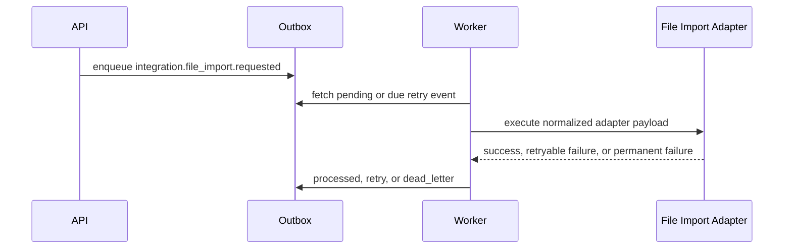

# DriveDesk Integration Adapters

This document describes the public-safe adapter foundation in DriveDesk Core.
It uses synthetic data and fake providers only.

## Goal

DriveDesk should be the operational workspace. External systems should connect
through adapters instead of leaking provider-specific payloads into the core
domain.

The first implementation slice is a fake file import adapter. It proves the
shape needed for later providers:

- provider-neutral adapter contract;
- API-created integration job;
- outbox event;
- worker execution;
- retry state for temporary failures;
- dead-letter state for permanent failures;
- result payload stored on the outbox event;
- public demo and OpenAPI evidence.

## Current Adapter Contract

Adapter execution returns a normalized result:

```json
{
  "adapter_key": "file.import.fake",
  "status": "partial_success",
  "message": "Imported 2 fake records from demo-leads-json.",
  "records_received": 3,
  "records_accepted": 2,
  "records_rejected": 1,
  "external_ref": "fake-import:demo-leads-json"
}
```

Temporary failures become retryable worker state. Permanent failures become
dead-letter state and need operator review.

## API Slice

The public OpenAPI schema includes:

```text
POST /tenants/{tenant_id}/integration-imports/file
```

This endpoint accepts synthetic file-import records and creates an outbox event
with `adapter_key = file.import.fake`.

## Worker Flow



## Status Model

| Status | Meaning |
| --- | --- |
| `pending` | Event is waiting for worker execution. |
| `processed` | Adapter completed and result was stored. |
| `retry` | Adapter failed temporarily and has `next_retry_at`. |
| `dead_letter` | Adapter failed permanently or exhausted retries. |

## Human Explanation

This is the first real proof of the DriveDesk integration idea. Later systems
such as accounting exports, bank imports, website forms, telephony, or messaging
providers can follow the same pattern: API creates a job, outbox stores it,
worker executes the adapter, and failures become visible operational state
instead of disappearing in logs.

The next layer is observability. `INTEGRATION_OBSERVABILITY.md` documents how
adapter jobs become Prometheus metrics, structured worker logs, and runbook
signals for retry and dead-letter handling.
