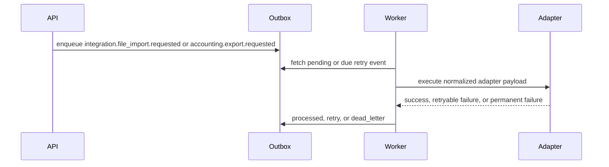

# DriveDesk Integration Adapters

This document describes the public-safe adapter foundation in DriveDesk Core.
It uses synthetic data and fake providers only.

## Goal

DriveDesk should be the operational workspace. External systems should connect
through adapters instead of leaking provider-specific payloads into the core
domain.

The first implementation slice was a fake file import adapter. The current
public runtime also includes a mock accounting export adapter. Together they
prove the shape needed for later providers:

- provider-neutral adapter contract;
- API-created integration job;
- outbox event;
- worker execution;
- field mapping transform and preview;
- connection scope enforcement;
- operation-level contracts for preview and execution;
- outbound export execution;
- operator review queue for failed integration jobs;
- retry state for temporary failures;
- dead-letter state for permanent failures;
- result payload stored on the outbox event;
- public demo and OpenAPI evidence.

## Current Adapter Contract

Adapter execution returns a normalized result:

```json
{
  "adapter_key": "file.import.fake",
  "status": "partial_success",
  "message": "Imported 2 fake records from demo-leads-json.",
  "records_received": 3,
  "records_accepted": 2,
  "records_rejected": 1,
  "external_ref": "fake-import:demo-leads-json"
}
```

Outbound export execution uses the same result shape:

```json
{
  "adapter_key": "accounting.export.mock",
  "status": "partial_success",
  "message": "Exported 2 mock accounting documents from batch_2026_06.",
  "records_received": 3,
  "records_accepted": 2,
  "records_rejected": 1,
  "external_ref": "mock-accounting-export:batch_2026_06"
}
```

Temporary failures become retryable worker state. Permanent failures become
dead-letter state and need operator review.
Failed integration jobs are listed through
`GET /tenants/{tenant_id}/integration-operator-review` with redacted payload
summaries and retry endpoints.
Reviewed `retry` and `dead_letter` events can be moved back to `pending`
through the outbox recovery endpoint. See `INTEGRATION_OPERATOR_REVIEW.md` and
`OUTBOX_RECOVERY.md`.

## API Slice

The public OpenAPI schema includes:

```text
GET /integration-adapters
POST /tenants/{tenant_id}/integration-connections
GET /tenants/{tenant_id}/integration-connections
POST /tenants/{tenant_id}/integration-mapping-preview
GET /tenants/{tenant_id}/integration-operator-review
POST /tenants/{tenant_id}/integration-imports/file
POST /tenants/{tenant_id}/integration-exports/accounting
POST /tenants/{tenant_id}/outbox-events/{event_id}/retry
```

`GET /integration-adapters` returns the executable runtime adapter catalog with
public-safe metadata, payload shape, mapping examples, and connection-profile
support flags. It also exposes operation contracts with endpoint, event, scope,
idempotency, retry, dead-letter, and operator-review metadata. See
`INTEGRATION_ADAPTER_CATALOG.md` and `INTEGRATION_OPERATION_CONTRACTS.md`.

Tenant-owned connection profiles can be scoped. For the public file-import
adapter, `file_import:preview` allows mapping preview and
`file_import:execute` allows import execution. See
`INTEGRATION_CONNECTION_SCOPES.md`.

The file-import endpoint accepts synthetic file-import records and creates an outbox event
with `adapter_key = file.import.fake`.
File imports can also reference a tenant-owned integration connection profile.
The worker applies connection mapping before adapter validation, and clients can
preview accepted/rejected normalized rows before creating outbox work. See
`INTEGRATION_CONNECTIONS.md` and `INTEGRATION_MAPPING_TRANSFORM.md`.

The accounting export endpoint accepts synthetic document summaries and creates
an outbox event with `adapter_key = accounting.export.mock`. It can reference a
tenant-owned connection profile scoped with `accounting:export`. Operator review
redacts raw `documents` and returns only safe batch/count/type summaries. See
`INTEGRATION_ACCOUNTING_EXPORT.md`.

## Worker Flow



## Status Model

| Status | Meaning |
| --- | --- |
| `pending` | Event is waiting for worker execution. |
| `processed` | Adapter completed and result was stored. |
| `retry` | Adapter failed temporarily and has `next_retry_at`. |
| `dead_letter` | Adapter failed permanently or exhausted retries. |

## Human Explanation

This is the first real proof of the DriveDesk integration idea. Later systems
such as accounting exports, bank imports, website forms, telephony, or messaging
providers can follow the same pattern: API creates a job, outbox stores it,
worker executes the adapter, and failures become visible operational state
instead of disappearing in logs.

The next layer is observability. `INTEGRATION_OBSERVABILITY.md` documents how
adapter jobs become Prometheus metrics, structured worker logs, and runbook
signals for retry and dead-letter handling.
