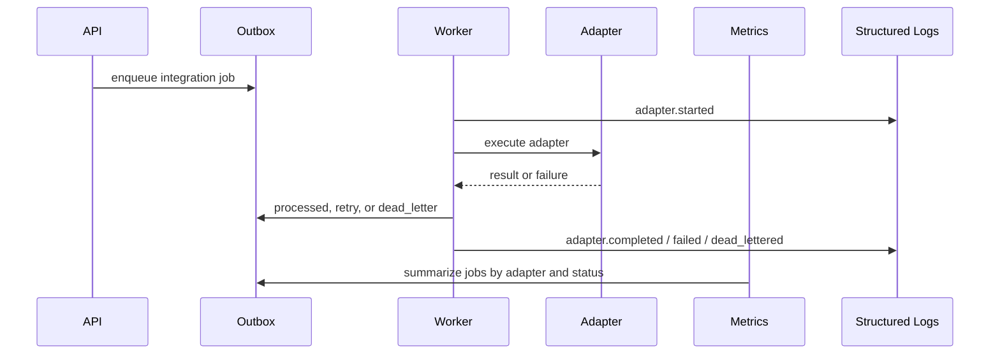

# DriveDesk Integration Observability

This document describes the public-safe observability contract for DriveDesk
integration adapters. It uses synthetic providers and fake data only.

## Goal

DriveDesk integrations should not be invisible background magic. Every adapter
job should produce enough safe operational signal to answer seven questions:

1. Which adapter ran?
2. Did it succeed, retry, or go to dead letter?
3. How many attempts happened?
4. How long did the adapter take?
5. Which safe log event explains the result?
6. Does provider-side evidence match the outbox result?
7. Which runbook-backed incidents are open?

## Metrics

The API metrics endpoint exposes integration state from the outbox:

```text
drivedesk_integration_jobs{adapter_key="file.import.fake",status="processed"} 1
drivedesk_integration_job_attempts{adapter_key="file.import.fake",status="processed"} 1
drivedesk_integration_job_errors{adapter_key="file.import.fake",status="retry"} 1
drivedesk_integration_adapter_duration_milliseconds{adapter_key="file.import.fake",status="processed"} 12.4
drivedesk_integration_connections{adapter_key="file.import.fake",status="active"} 1
drivedesk_integration_connection_checks{adapter_key="file.import.fake",status="passed"} 1
drivedesk_integration_reconciliations{adapter_key="accounting.export.mock",status="matched"} 1
drivedesk_integration_incidents{adapter_key="accounting.export.mock",severity="critical",status="open"} 2
drivedesk_integration_jobs{adapter_key="accounting.export.mock",status="dead_letter"} 1
drivedesk_integration_connections{adapter_key="accounting.export.mock",status="active"} 1
```

Metric meaning:

| Metric | Meaning |
| --- | --- |
| `drivedesk_integration_jobs` | Number of integration outbox jobs grouped by adapter and status. |
| `drivedesk_integration_job_attempts` | Total worker attempts for those jobs. |
| `drivedesk_integration_job_errors` | Jobs with a recorded adapter error. |
| `drivedesk_integration_adapter_duration_milliseconds` | Average adapter duration for jobs with duration evidence. |
| `drivedesk_integration_connections` | Number of tenant-owned connection profiles grouped by adapter and status. |
| `drivedesk_integration_connection_checks` | Number of connection diagnostics grouped by adapter and result status. |
| `drivedesk_integration_connection_check_duration_milliseconds` | Average connection diagnostics duration. |
| `drivedesk_integration_reconciliations` | Number of provider evidence reconciliations grouped by adapter and status. |
| `drivedesk_integration_incidents` | Number of runbook-backed integration incidents grouped by adapter, severity, and status. |

The labels use `adapter_key` and `status` only. They do not include names,
connection ids, phone numbers, tenant-specific provider payloads, file contents,
credentials, mapping values, config values, or concrete user identifiers.

## Structured Logs

The worker emits JSON events for adapter execution:

```json
{
  "event_type": "adapter.completed",
  "service": "drivedesk-worker",
  "adapter_key": "file.import.fake",
  "outbox_event_type": "integration.file_import.requested",
  "status": "partial_success",
  "duration_ms": 12.4,
  "records_received": 3,
  "records_accepted": 2,
  "records_rejected": 1
}
```

Current adapter log event types:

- `adapter.started`
- `adapter.completed`
- `adapter.failed`
- `adapter.dead_lettered`

The log contract intentionally records normalized counts and operational
context, not raw provider payloads.

## Operational Flow



## Failure Handling

Temporary failures move to `retry` with a future retry time. Permanent failures
move to `dead_letter` and require operator review.
Operators can list failed integration jobs through
`GET /tenants/{tenant_id}/integration-operator-review`. That review queue
returns adapter key, operation key, required scope, status, attempts, safe
payload summary, recommended action, and retry endpoint without returning raw
provider payloads.
For accounting exports, the safe payload summary includes batch id, document
count, document types, and `raw_documents_redacted`, but not raw `documents`.
After review, operators can call
`POST /tenants/{tenant_id}/outbox-events/{event_id}/retry` to move a failed
event back to `pending`. That recovery action writes
`outbox_event.retry_requested` to the audit log.

The public-safe operational contract is:

- retry and dead-letter counts are visible through metrics;
- structured logs explain the safe failure context;
- runbooks describe first checks and recovery;
- operator review cards are available through a tenant-scoped API;
- connection diagnostics expose latest integration readiness before work is
  queued;
- operator retry requests are audited;
- the public demo shows Integration Health with fake data.

## Human Explanation

This is what makes integrations production-shaped. A basic adapter only moves
data. A serious adapter also tells operators whether it is healthy, why it
failed, how many attempts happened, and what to do next without leaking private
data into logs, metrics, screenshots, or public documentation.

The same rule is now used by the auth surface. `drivedesk_auth_sessions` and
`drivedesk_auth_attempts_total` expose aggregate session and login-attempt
health, but avoid emails, user ids, tenant ids, token ids, token hashes, bearer
tokens, and request bodies.

Storage-backed metrics degrade with `drivedesk_metrics_storage_available 0`
instead of turning the whole `/metrics` scrape into a 500 response.

`AUTH_OBSERVABILITY.md` documents the matching auth alert names and runbook
shape for these aggregate signals.
