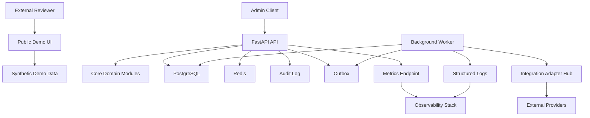
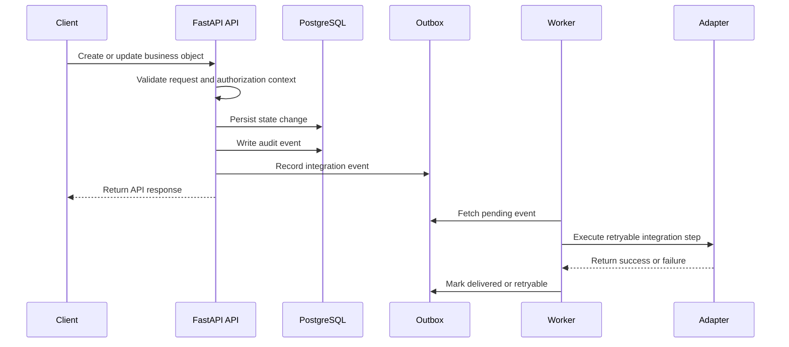
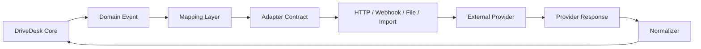
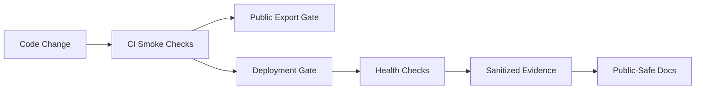
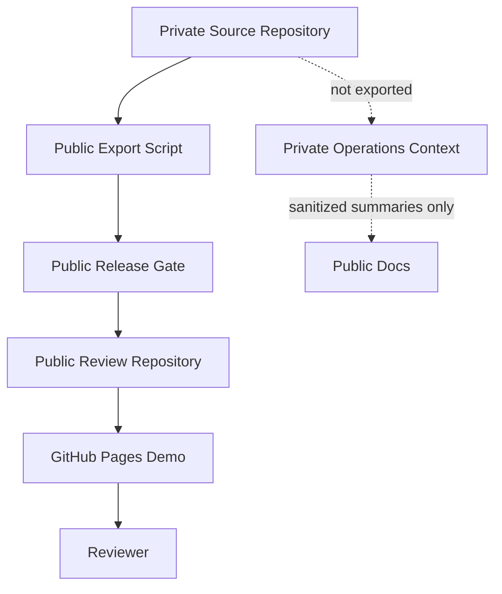

# DriveDesk System Design

This document is the public-safe system design overview for DriveDesk Core. It
describes the engineering shape without exposing private infrastructure,
customer operations, hostnames, addresses, credentials, or runtime paths.

## Design Goal

DriveDesk Core is built as a business operations platform foundation.

The first product direction is operational software for driving-school style
workflows, but the backend foundation is intentionally generic:

- tenants and memberships;
- users and roles;
- audit events;
- outbox events;
- background workers;
- integration adapters;
- observability;
- release gates and evidence.

The system starts as a modular monolith. That keeps development and deployment
simple while still creating boundaries that can become services later if there
is a real operational reason.

## High-Level Architecture

## Runtime Responsibilities

| Layer | Responsibility |
| --- | --- |
| Public demo | Reviewable static UI with synthetic data. |
| API | HTTP contract, validation, tenant-aware operations, audit writes. |
| Core modules | Domain rules that should not depend on web framework details. |
| Database | Durable business state, migrations, audit and outbox storage. |
| Worker | Async processing, retryable jobs, future adapter execution. |
| Adapter hub | Boundary for external systems such as file imports, webhooks, and provider APIs. |
| Observability | Metrics, logs, alerts, dashboards, and runbook-backed evidence. |
| CI/CD | Repeatable checks before code is treated as deployable. |

## Request And Event Flow

## Adapter Boundary

DriveDesk should not let external systems leak into the core domain directly.
Each external connection should pass through an adapter contract:

Adapter rules:

- core objects stay provider-neutral;
- provider payloads are normalized before reaching the domain;
- retries are owned by the worker and outbox layer;
- failed delivery becomes visible operational state;
- sensitive provider details stay out of public docs and public demo data.

The first implemented adapter is documented in `INTEGRATION_ADAPTERS.md`. It
uses synthetic file-import data to prove the API -> outbox -> worker -> adapter
flow, including retry and dead-letter states.

Integration observability is documented in `INTEGRATION_OBSERVABILITY.md`. It
shows how adapter jobs become metrics, structured worker logs, and
runbook-backed operational signals.

## CI/CD And Evidence Flow

The important idea is that the project does not treat started containers as
enough evidence. A change is stronger when checks prove API behavior, schema
generation, demo availability, observability configuration, and public export
boundaries.

## Public And Private Boundary

Public repository content is meant to show engineering quality:

- source code for the platform foundation;
- OpenAPI schema;
- public demo shell;
- public CI;
- public demo health workflow;
- ADRs and architecture docs;
- sanitized evidence.

Private repository content remains the working product and operations source:

- deployment internals;
- real operational history;
- live environment details;
- customer or tenant-specific context;
- sensitive configuration.

## Scaling Direction

The first scaling step is not microservices. The first scaling step is stronger
boundaries inside the modular monolith:

1. Keep domain logic out of HTTP handlers.
2. Keep provider-specific logic inside adapters.
3. Keep async delivery behind outbox and worker contracts.
4. Keep tenant and role checks explicit.
5. Keep observability and release evidence part of every serious change.

Services can be extracted later when the reason is concrete: independent
scaling, independent release cadence, provider isolation, or operational risk
reduction.

## Human Explanation

This page is the short answer to "how is the system built?" It lets a reviewer
see the shape of the platform before reading code: where requests enter, where
state is stored, how background work runs, where integrations belong, and how
the public demo is separated from private operations.
