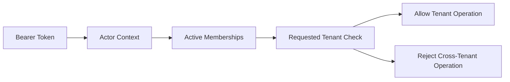

# DriveDesk Tenant Isolation

DriveDesk Core is a multi-tenant platform foundation. A user can have a role in
one tenant without becoming a platform-wide administrator.

## Current Rules

- Bearer-token requests are resolved through active memberships.
- `GET /tenants` returns only tenants where the current user has membership.
- `GET /users` returns only users who share one of the current user's tenants.
- Tenant endpoints require membership in the requested tenant.
- A valid bearer token is rejected when it targets a tenant outside the user's
  memberships.
- Global bootstrap endpoints stay outside bearer-token access:
  - `POST /tenants`;
  - `POST /users`.

Those bootstrap endpoints still exist for local setup and controlled seed flows.
They are not treated as tenant-owner capabilities.

## Why This Matters

Multi-tenant isolation is one of the highest-risk SaaS boundaries. The important
rule is simple:

```text
owner in tenant A != owner of the whole platform
```

This keeps role checks aligned with the requested tenant instead of only using
the highest role the user has anywhere.

## Verified Behavior

The Core API tests cover this scenario:

```text
tenant A owner logs in
tenant B exists
tenant A owner lists tenants -> only tenant A
tenant A owner lists users -> only tenant A users
tenant A owner reads tenant B -> rejected
tenant A owner reads tenant B memberships -> rejected
tenant A owner creates global tenant/user with bearer token -> rejected
```

## Reusable Scope Module

Tenant filtering is centralized in:

```text
apps/api/drivedesk_api/tenant_scope.py
```

Current helpers:

- `actor_member_tenant_ids()`;
- `list_tenants_for_actor()`;
- `list_users_for_actor()`.

The goal is to keep future endpoint groups from copying tenant filters by hand.
When contracts, payments, lessons, documents, and tasks are added, they should
use the same tenant-scope pattern.

## Tenant-Owned Repository Helper

Tenant-owned query construction is centralized in:

```text
apps/api/drivedesk_api/tenant_repository.py
```

Current helpers:

- `tenant_owned_select()`;
- `list_tenant_owned()`.

Current tenant-owned list endpoints for memberships, audit events, and outbox
events use the helper after explicit permission checks. The point is to make
`tenant_id` filtering the default path for future contracts, payments, lessons,
documents, and tasks.

## Request Flow



## Next Hardening

Recommended next slices:

1. Apply tenant-owned repository helpers to future contracts, payments, lessons,
   documents, and tasks.
2. Add a dedicated platform-admin model instead of reusing tenant roles.
3. Add public-safe tenant-isolation metrics with synthetic data.
4. Add database-level row isolation once the Core data model stabilizes.
